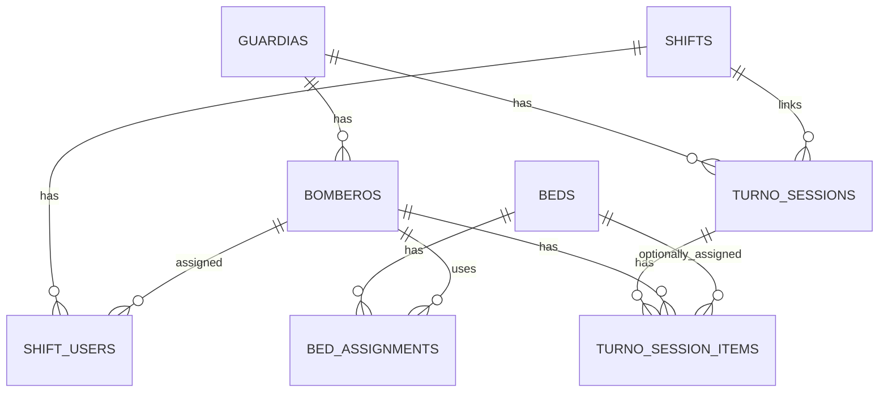
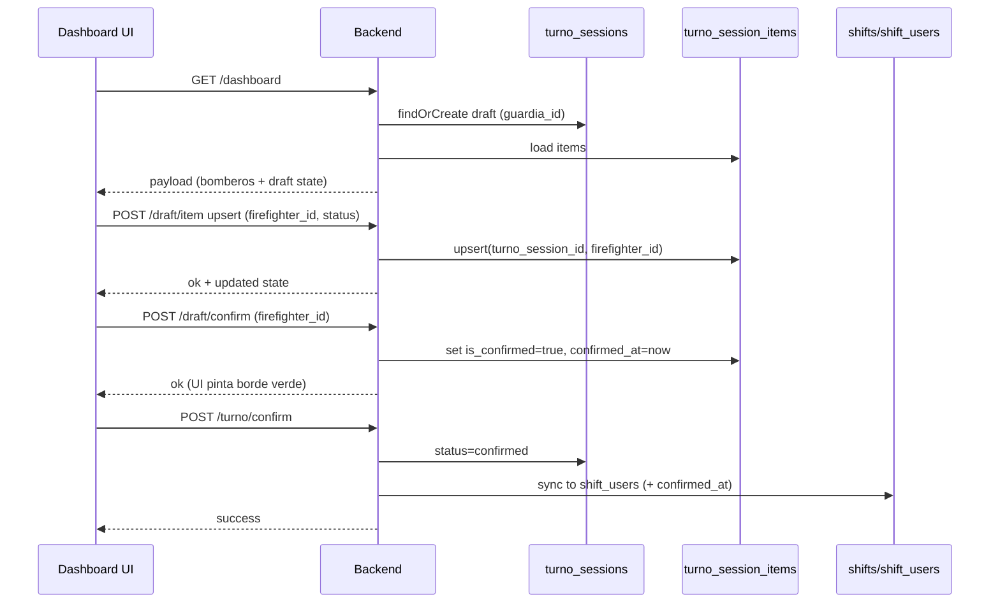

# Persistencia de estado del Dashboard (Draft de Turno)

## 1. Objetivo

Resolver de forma estructural y auditable los problemas de estado “temporal” que hoy viven en el navegador (por ejemplo `sessionStorage`) y que se pierden al:

- recargar la página
- cerrar el navegador
- cambiar de dispositivo
- expirar sesión

Esto impacta directamente:

- **colores/estados visuales** (ej: borde verde de confirmado)
- **asignación de camas** (no hay una “fuente de verdad” de quién está realmente constituido/confirmado antes del guardado final)
- trazabilidad (quién confirmó qué y cuándo)

La propuesta agrega una capa de **Draft de Turno** (sesión persistida) sin romper el flujo actual.

---

## 2. Cómo funciona HOY (modelo actual)

### 2.1 ¿Qué entidad define el “turno” hoy?

En el sistema actual, el “turno” está definido por la tabla/modelo:

- `shifts` (`App\Models\Shift`)

Un turno tiene:

- `date` (fecha del turno)
- `shift_leader_id` (jefe de turno)
- `status`: `active | closed`

**Importante**: el turno se usa como entidad operativa “en vivo” para el Dashboard.

### 2.2 ¿Dónde queda la asistencia “final” hoy?

El registro final/principal de “quién estuvo en turno” queda en:

- `shift_users` (`App\Models\ShiftUser`)

Ahí se guardan cosas como:

- `shift_id`
- `firefighter_id` (principal)
- `attendance_status` (constituye, reemplazo, etc.)
- `confirmed_at` (cuando aplica)
- `start_time`, `end_time`

**Además**, existe una tabla de “marca de guardado” que se usa para saber si ya se guardó la asistencia del día:

- `guardia_attendance_records` (mencionada en `docs/FLUJOS_SISTEMA.md`)

### 2.3 ¿Cuál es el problema entonces?

Hay estados “intermedios” (ej: confirmación por código, borde verde, selección previa, etc.) que pueden estar:

- en el front (JS)
- en variables temporales
- parcialmente en `shift_users`

Eso produce inconsistencias:

- UI muestra confirmaciones que **no sobreviven** refresh.
- Camas no pueden basarse en un estado “de verdad” previo a la confirmación/guardado.
- Auditoría limitada de cambios.

---

## 3. Propuesta: Draft de Turno (persistencia previa)

### 3.1 Principio clave: “Source of Truth” en BD

La UI **no debería** decidir el color por estado local, sino derivarlo de un estado persistido.

Ejemplo:

- borde verde = `draft_item.status = 'confirmed'` o `draft_item.confirmed_at != null`

### 3.2 Estrategia de bajo riesgo

- **No reemplazar** `shifts/shift_users` inmediatamente.
- Agregar 2 tablas nuevas (draft) y hacer que el dashboard las use.
- Mantener compatibilidad: al “finalizar/guardar”, se sincroniza hacia `shift_users` (o se marca `shift_users` con `confirmed_at`).

---

## 4. Nuevas tablas propuestas

> Nombres sugeridos: `turno_sessions` y `turno_session_items`.
> Puedes renombrarlas a algo más alineado al dominio (`guardia_sessions`, `attendance_drafts`, etc.).

### 4.1 Tabla: `turno_sessions`

**Propósito**: representa una “sesión de turno” del dashboard (draft) para una guardia y una ventana temporal.

Columnas sugeridas:

- `id` (PK)
- `guardia_id` (FK `guardias.id`, requerido)
- `shift_id` (FK `shifts.id`, nullable)  
  - permite enlazar el draft al turno activo real cuando existe
- `status` (enum/string): `draft | confirmed | closed`
- `opened_at` (datetime)
- `confirmed_at` (datetime, nullable)
- `closed_at` (datetime, nullable)
- `created_by_user_id` (FK `users.id`, nullable)
- `updated_by_user_id` (FK `users.id`, nullable)
- `meta` (json, nullable) para flags futuros
- timestamps

Índices recomendados:

- `unique(guardia_id, status)` si decides 1 draft activo por guardia
- o `index(guardia_id, opened_at)` si permites varios

### 4.2 Tabla: `turno_session_items`

**Propósito**: estado por bombero dentro de la sesión.

Columnas sugeridas:

- `id` (PK)
- `turno_session_id` (FK `turno_sessions.id`, requerido)
- `firefighter_id` (FK `bomberos.id`, requerido)
- `attendance_status` (string/enum): `constituye | reemplazo | refuerzo | permiso | ausente | licencia | falta | inhabilitado`
- `is_present` (boolean)
- `is_confirmed` (boolean)
- `confirmed_at` (datetime, nullable)
- `confirmed_by_user_id` (FK `users.id`, nullable)
- `confirm_source` (string, nullable) ej: `code`, `admin_manual`
- `confirm_ip` (string, nullable)
- `confirm_user_agent` (string, nullable)
- `bed_id` (FK `beds.id`, nullable) o (mejor) `bed_assignment_id` si quieres trazabilidad completa
- `notes` (text, nullable)
- timestamps

Índices recomendados:

- `unique(turno_session_id, firefighter_id)` para evitar duplicados
- `index(firefighter_id)`
- `index(confirmed_at)`

---

## 5. Relaciones entre tablas (actual + nuevas)

### 5.1 Relaciones actuales relevantes

- `guardias (1) -> (N) bomberos`
- `shifts (1) -> (N) shift_users`
- `bomberos (1) -> (N) shift_users`
- `beds (1) -> (N) bed_assignments`
- `bomberos (1) -> (N) bed_assignments`

### 5.2 Relaciones nuevas

- `guardias (1) -> (N) turno_sessions`
- `turno_sessions (1) -> (N) turno_session_items`
- `bomberos (1) -> (N) turno_session_items`
- `turno_sessions (N) -> (1) shifts` *(opcional)*
- `turno_session_items (N) -> (1) beds` *(opcional, si asignas cama desde el draft)*

### 5.3 Diagrama ERD (Mermaid)

---

## 6. Flujo propuesto (end-to-end)

### 6.1 Flujo resumido

1. **Abrir Dashboard**
   - resolver guardia actual del usuario
   - obtener o crear `turno_sessions` en `status='draft'`
2. **Listar bomberos**
   - usar `bomberos` de la guardia
   - mergear con `turno_session_items` para pintar estado
3. **Cambiar estado / confirmar**
   - cada acción del UI hace `upsert` de `turno_session_items`
4. **Colores**
   - el color viene de `turno_session_items` (persistido)
5. **Asignación de cama**
   - permitido solo si `is_confirmed=true` (regla)
6. **Confirmar/Guardar turno**
   - `turno_sessions.status='confirmed'`
   - sincronizar a `shift_users` (crear/actualizar filas)
   - opcional: crear `guardia_attendance_records`
7. **Cerrar turno**
   - `turno_sessions.status='closed'`
   - cerrar `shifts` (si aplica)

### 6.2 Diagrama de secuencia (Mermaid)

---

## 7. Cómo esto soluciona los “colores”

Hoy el borde verde se pierde porque el estado vive en el navegador. Con draft:

- el UI no “recuerda” nada localmente
- la API devuelve `turno_session_items.is_confirmed`
- el componente pinta verde si `true`

Resultado: el borde verde **sobrevive refresh y cambio de dispositivo**.

---

## 8. Impacto y riesgos

### 8.1 Riesgo técnico

**Bajo si se implementa incremental**:

- No se toca el histórico en `shift_users`.
- Se agrega una capa nueva.
- Se puede activar con feature flag.

### 8.2 Aspectos que mejoran además de camas/colores

- Auditoría: `confirmed_by_user_id`, `confirmed_at`, `confirm_ip`.
- Multi-dispositivo real.
- Menos bugs por refresh/back button.
- Base para notificaciones (“faltan X por confirmar”).
- Base para reglas duras: “sin confirmación no hay cama”.

---

## 9. Implementación sugerida (pasos)

### Paso 1 (MVP seguro)

- crear tablas `turno_sessions` + `turno_session_items`
- endpoints de upsert para estado/confirmación
- UI consume draft para pintar colores

### Paso 2

- reglas de cama basadas en draft
- opcional: asignación de cama “solo confirmados”

### Paso 3

- sincronización completa con `shift_users`
- cierre formal del turno

---

## 10. Notas de compatibilidad con el sistema actual

- El “turno” hoy ya existe como `Shift`.
- El “final” ya existe como `ShiftUser`.
- La capa draft se acopla bien porque **no compite** con esas tablas; las alimenta.

---

## 11. Checklist de definición (para cerrar diseño)

- ¿Un draft es 1 por guardia por día?
- ¿Cómo se define el rango del turno (21:00–10:00)?
- ¿Quién puede editar el draft (solo guardia/solo super_admin)?
- ¿Se permite 2 personas editando simultáneo?

---

*Documento creado para Guardia Nocturna (Feb 2026)*
